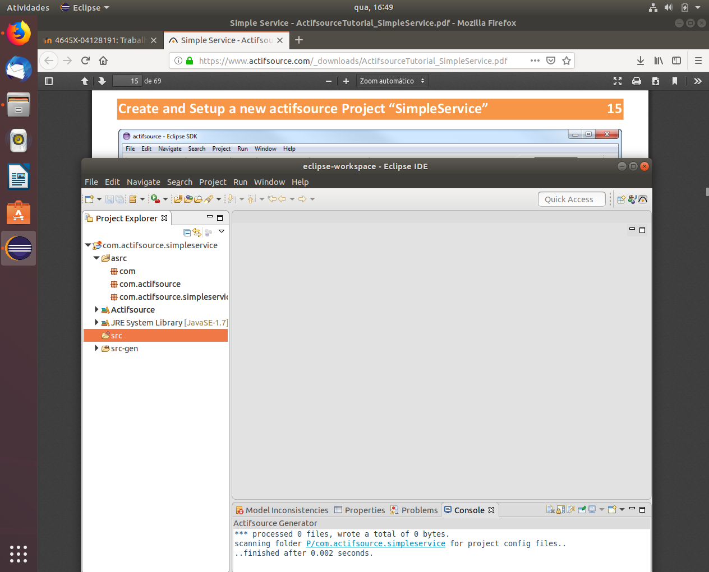
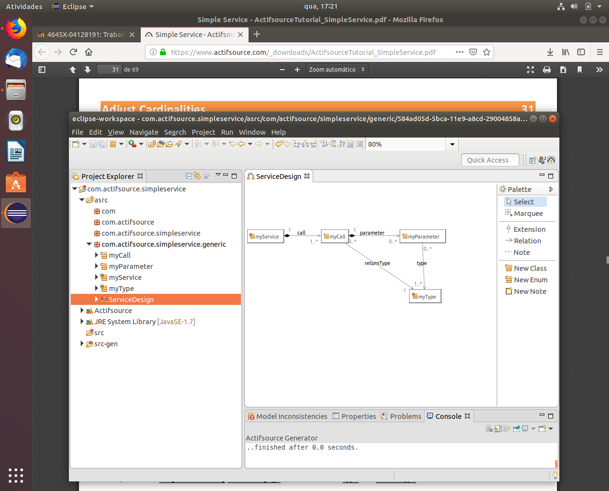
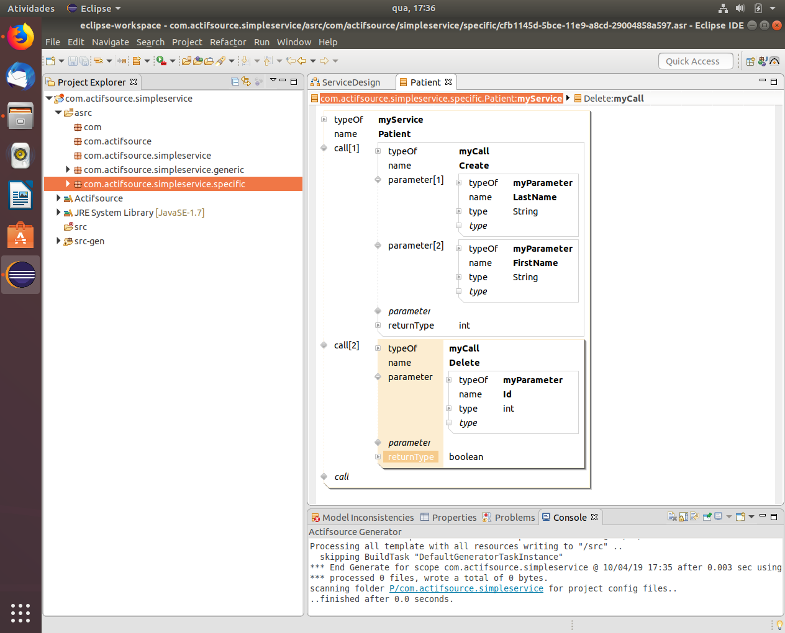
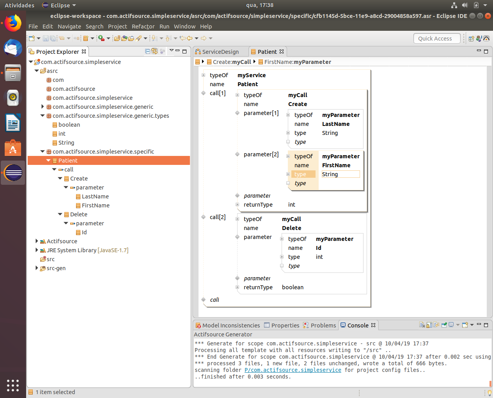
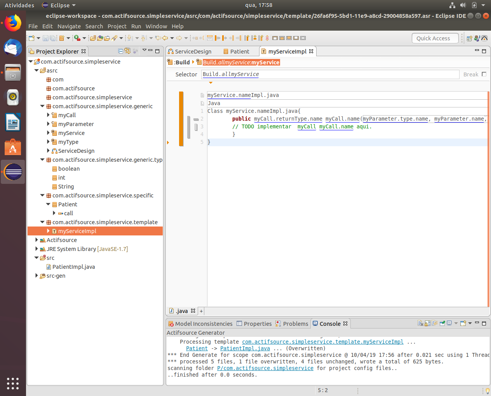
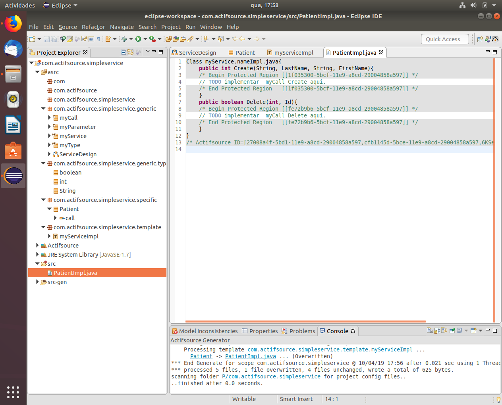

# T2 - Engenharia de Software Orientada à modelos
***
Realizei o tutorial: (A) "Gostaria de automatizar a geração de código para diversos modelos."  
[Actifsource Tutorials: Simple Service](https://www.actifsource.com/tutorials/actifsource_workbench_community/simple_service.html)
***

### 1.Criando o projeto do actifsource

### 2.Criando o diagrama de classes, linkando as relações e arrumando a cardinalidade de acordo com o tutorial

Perceba aqui que o nome das relações difere do tutorial, entretanto o símbolo das relações permanece o mesmo.

### 3.Criando o resource myService

Perceba a estrutura de packages na segunda imagem.

### 4.Criando o template gerador de código

Template e o código resultante respectivamente.
***

O projeto do Eclipse com os fontes podem ser encontrados [aqui](./com.actifsource.simpleservice).
